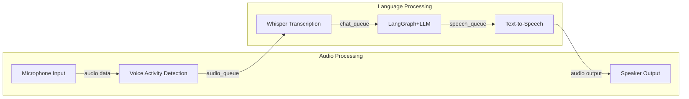
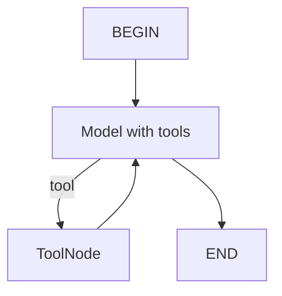

# Elise AI Voice Chat

A real-time voice assistant that uses OpenAI's Whisper for speech recognition, LangChain with Claude 3.7 for conversation, and Kokoro text-to-speech for responses.

## Overview

This project creates a voice-based conversational assistant that:

1. Listens for speech using your microphone
2. Detects when you start and stop speaking
3. Transcribes your speech using OpenAI's Whisper model
4. Processes your request using LangChain with Claude 3.7
5. Speaks the response using Kokoro text-to-speech

The system is designed to minimize latency in conversational AI by using efficient audio processing, speech detection, and response generation.

### Overview flowchart 



### Langgraph diagram



## Components

### Speech Recognition (ASR)

- Uses OpenAI's Whisper Turbo model for fast and accurate speech recognition
- Supports multiple languages with automatic language detection
- Processes audio in real-time without saving to disk

### Voice Activity Detection (VAD)

- Implements RMS-based silence detection to determine when speech starts and ends
- Configurable silence threshold and duration parameters
- Efficiently captures complete utterances without unnecessary audio
- See [VAD](https://en.wikipedia.org/wiki/Voice_activity_detection) for more generic information.

### Language Model (LLM)

- Uses LangChain with LLM models for natural conversation
    - Supports Anthropic, OpenAI, Ollama
- Maintains conversation context for coherent multi-turn interactions
- Configured for concise responses suitable for voice interaction

### Text-to-Speech (TTS)

- Uses [Kokoro](https://huggingface.co/hexgrad/Kokoro-82M) text-to-speech capabilities

## Requirements

- MacOS/Windows
- API Key or Ollama
    - Anthropic
    - OpenAI
    - Ollama

## Installation

### Mac

1. Install required components.

```bash
brew install uv portaudio
```

### Windows

1. Install required components as Admin.

```bash
choco install git make uv
```

### Common

2. Clone this repository
3. Install dependencies using uv:

```bash
uv sync
```

4. Make `.env` file

```
ANTHROPIC_API_KEY=<your_anthropic_api_key>
OPENAI_API_KEY=<your_openai_api_key>
OLLAMA_HOST=<ollama_host>
OLLAMA_PORT=<ollama_port>
```

## Usage

Run the application using the provided Makefile:

For English conversation:

```bash
make run
```

For Japanese conversation:

```bash
make run-ja
```

To stop the application, press Ctrl+C.

## Development

The project includes several Makefile commands to help with development:

- `make run`: Run the application
- `make test`: Run unit tests
- `make fmt`: Format code using ruff
- `make lint` or `make check`: Run linting checks
- `make fix`: Automatically fix linting issues
- `make help`: Display available commands

## Project Structure

- `src/main.py`: Main application logic and audio processing
- `src/transcribe.py`: Whisper integration for speech recognition
- `src/chat.py`: LangChain and Claude integration for conversation
- `src/voice.py`: Text-to-speech functionality

## References

- [OpenAI Whisper](https://github.com/openai/whisper)
- [LangChain](https://python.langchain.com/docs/get_started/introduction)
- [Claude API](https://docs.anthropic.com/claude/reference/getting-started-with-the-api)
- [Optimizing Latency for Conversational AI](https://elevenlabs.io/blog/how-do-you-optimize-latency-for-conversational-ai)

## TODO

- Ctrl-C doesn't stop asycio tasks correctly.
    - https://stackoverflow.com/questions/48562893/how-to-gracefully-terminate-an-asyncio-script-with-ctrl-c
- https://python.langchain.com/docs/how_to/chatbots_memory/
- Adaptive Echo Cancellation
    - https://github.com/varuncm/echo-cancel
    - https://pypi.org/project/adaptfilt/
    - https://github.com/echocatzh/SPEEX-AEC-python
    - https://github.com/fjiang9/NKF-AEC
- UI
    - Urwid, rich

## License

[Add license information here]
